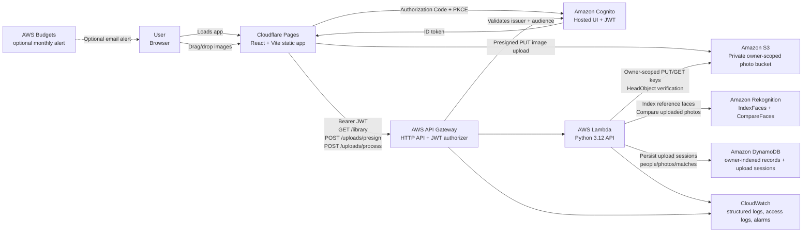

# Architecture

FaceID is split into a static frontend and an AWS serverless backend. The frontend can run independently in mock mode for UI review. When the AWS environment variables are set, users sign in through Cognito, browser uploads go directly to S3 through owner-scoped presigned URLs, Lambda verifies upload sessions and S3 object metadata, and Lambda coordinates Rekognition and DynamoDB updates for the authenticated user.

## Container Diagram

## Runtime Flow

1. The browser loads the React app from Cloudflare Pages.
2. If `VITE_API_BASE_URL` is unset, the app uses mock people/photos and simulated matching.
3. If the AWS API and Cognito variables are set, the app redirects unsigned users through Cognito Hosted UI with Authorization Code + PKCE.
4. The frontend sends the Cognito ID token as a bearer token to API Gateway.
5. API Gateway validates the JWT issuer and audience before invoking Lambda.
6. Lambda derives the owner from the Cognito `sub` claim.
7. For uploads, the frontend calls `/uploads/presign` with file metadata.
8. Lambda creates short-lived upload session records in DynamoDB.
9. Lambda returns upload session IDs and presigned S3 PUT URLs under `users/<owner>/<mode>/...`.
10. The browser uploads image bytes directly to the private S3 bucket with signed upload metadata.
11. The frontend calls `/uploads/process` with the uploaded S3 keys and upload session IDs.
12. Lambda verifies the upload session, S3 object size, content type, and S3 metadata before processing.
13. Reference uploads are indexed with Rekognition `IndexFaces` and saved as people records.
14. Photo uploads are compared against bounded reference images with Rekognition `CompareFaces`.
15. Lambda writes owner-scoped photo and match metadata to DynamoDB and returns preview URLs and match states.
16. Lambda emits structured request logs; API Gateway emits JSON access logs.
17. CloudWatch alarms track Lambda errors, Lambda throttles, and API 5xx responses.

## Deployment Shape

- **Frontend:** Cloudflare Pages serves the Vite build output from `dist`.
- **Backend:** Terraform creates Cognito, API Gateway JWT authorization, Lambda, S3, DynamoDB tables, Rekognition collection, IAM policy, CloudWatch logs, alarms, and optional budget alerts.
- **Configuration:** Cloudflare Pages needs `VITE_API_BASE_URL`, `VITE_AUTH_CLIENT_ID`, and `VITE_AUTH_DOMAIN` from Terraform outputs for AWS mode.
- **CI:** GitHub Actions runs linting, tests, frontend build, Lambda syntax checks, Terraform formatting, and Terraform validation.
- **Teardown:** `terraform destroy` removes the backend resources. The S3 bucket defaults to `force_destroy_bucket = true` for prototype cleanup.

## Key Constraints

- The hosted demo can operate without AWS by using mock data.
- AWS API routes require a Cognito JWT when deployed from Terraform.
- The application scopes records by Cognito `sub`, but it does not include a full account-management or retention workflow.
- Upload session records are short-lived and protected by DynamoDB TTL, but TTL cleanup is eventually consistent.
- CloudWatch alarms are lightweight and low-volume oriented; incident response is limited to optional email notifications.
- The frontend stores short-lived tokens in session storage and does not currently perform silent refresh.
- Uploads are capped by Lambda-configured file count and file size guardrails.
- Matching cost grows with `uploaded photos * compared people * reference images per person`.
- The current MVP does not crop every detected face in group photos before matching.
- S3 objects remain private; browser access uses short-lived signed URLs.
