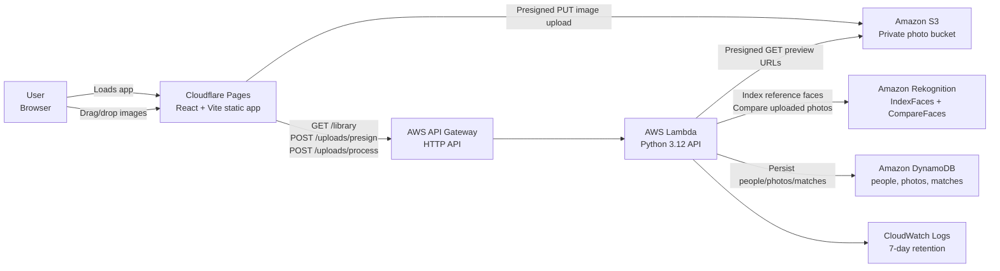

# Architecture

FaceID is split into a static frontend and an optional AWS serverless backend. The frontend can run independently in mock mode for UI review. When `VITE_API_BASE_URL` points at the deployed API, browser uploads go directly to S3 through presigned URLs and Lambda coordinates Rekognition and DynamoDB updates.

## Container Diagram

## Runtime Flow

1. The browser loads the React app from Cloudflare Pages.
2. If `VITE_API_BASE_URL` is unset, the app uses mock people/photos and simulated matching.
3. If `VITE_API_BASE_URL` is set, the app loads `/library` from the AWS API.
4. For uploads, the frontend calls `/uploads/presign` with file metadata.
5. Lambda returns presigned S3 PUT URLs.
6. The browser uploads image bytes directly to the private S3 bucket.
7. The frontend calls `/uploads/process` with the uploaded S3 keys.
8. Reference uploads are indexed with Rekognition `IndexFaces` and saved as people records.
9. Photo uploads are compared against bounded reference images with Rekognition `CompareFaces`.
10. Lambda writes photo and match metadata to DynamoDB and returns preview URLs and match states.

## Deployment Shape

- **Frontend:** Cloudflare Pages serves the Vite build output from `dist`.
- **Backend:** Terraform creates API Gateway, Lambda, S3, DynamoDB, Rekognition collection, IAM policy, and CloudWatch log retention.
- **Configuration:** Cloudflare Pages needs `VITE_API_BASE_URL` set to Terraform's `api_base_url` output for AWS mode.
- **Teardown:** `terraform destroy` removes the backend resources. The S3 bucket defaults to `force_destroy_bucket = true` for prototype cleanup.

## Key Constraints

- The hosted demo can operate without AWS by using mock data.
- The AWS API currently has no authentication layer.
- Uploads are capped by Lambda-configured file count and file size guardrails.
- Matching cost grows with `uploaded photos * compared people * reference images per person`.
- The current MVP does not crop every detected face in group photos before matching.
- S3 objects remain private; browser access uses short-lived signed URLs.
